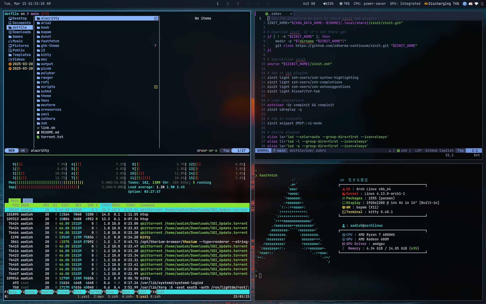

# Dotfile Repository

## Picture of my desktop



## Overview
This repository contains my personalized system configuration files, carefully crafted and optimized to enhance my computing experience across multiple Linux distributions.

## Key Features
- **Comprehensive Configuration**: Meticulously curated settings for various system components
- **Cross-Distribution Compatibility**: Seamless configuration management across different Linux environments
- **Efficient Management**: Utilizing **Stow** for streamlined dotfile synchronization

## Tool: Stow
**Stow** is a powerful symlink farm manager that simplifies dotfile deployment:
- Automatically creates symbolic links between configuration files
- Enables easy version control and synchronization
- Provides a modular approach to system configuration

## Quick Setup
1. Clone the repository
2. Install Stow
3. Run `stow <package-name>` to symlink configurations

## Structure
```
dotfile/
├── zsh/
├── wezterm/
├── tmux/
├── i3/
└── ...
```

## Customization
Feel free to fork, adapt, and personalize these configurations to suit your own workflow.

