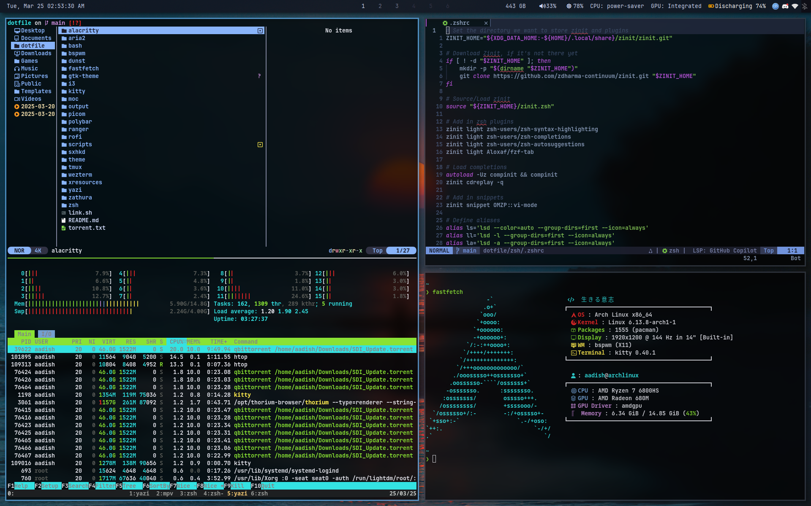
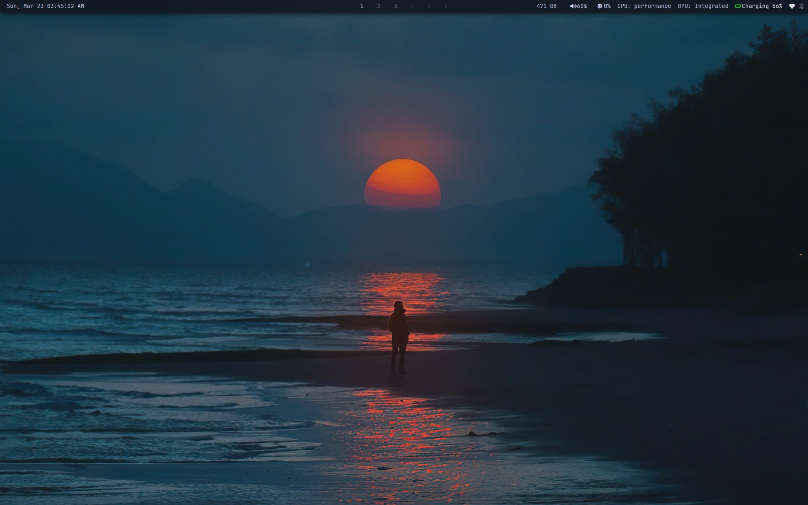
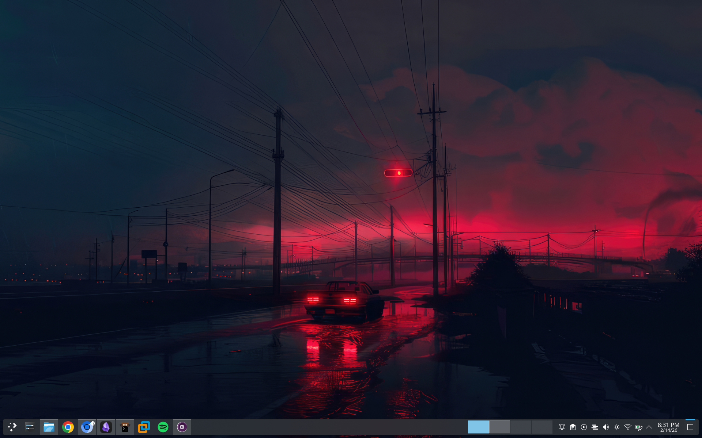

# Dotfiles

My personal configuration files for Linux systems, managed with GNU Stow.

## Table of Contents

- [Overview](#overview)
- [Screenshots](#screenshots)
- [Features](#features)
- [Prerequisites](#prerequisites)
- [Installation](#installation)
- [Configurations Included](#configurations-included)
- [Usage](#usage)
- [Structure](#structure)
- [Customization](#customization)
- [Contributing](#contributing)
- [License](#license)

## Overview

This repository contains my carefully curated dotfiles for various applications and tools I use daily. The configurations are organized using **GNU Stow**, which creates symlinks from this repository to your home directory, making it easy to version control and deploy configurations across multiple machines.

## Screenshots

### i3 Window Manager



### KDE Plasma


## Features

- **Symlink Management**: Powered by GNU Stow for easy deployment
- **Version Controlled**: All configurations tracked with Git
- **Multiple Themes**: Consistent theming across applications
- **Performance Optimized**: Lightweight and efficient configurations
- **Modular Design**: Install only what you need
- **Cross-Distribution**: Compatible with multiple Linux distributions

## Prerequisites

Before installing these dotfiles, ensure you have the following:

- **Git**: For cloning the repository
- **GNU Stow**: For managing symlinks
- **Bash/Zsh**: Shell environment

### Installing Stow

**Arch Linux:**
```bash
sudo pacman -S stow
```

**Debian/Ubuntu:**
```bash
sudo apt install stow
```

**Fedora:**
```bash
sudo dnf install stow
```

## Installation

1. **Clone the repository:**
   ```bash
   git clone https://github.com/yourusername/dotfiles.git ~/dotfiles
   cd ~/dotfiles
   ```

2. **Install specific configurations:**
   ```bash
   stow zsh        # Install zsh configuration
   stow tmux       # Install tmux configuration
   stow i3         # Install i3 window manager config
   ```

3. **Install all configurations:**
   ```bash
   stow */
   ```

4. **Remove/uninstall a configuration:**
   ```bash
   stow -D zsh     # Remove zsh configuration
   ```

## Configurations Included

### Window Managers & Desktop Environments
- **i3**: Tiling window manager with custom keybindings and scripts
- **bspwm**: Binary space partitioning window manager
- **Hyprland**: Dynamic tiling Wayland compositor
- **KDE**: KDE Plasma desktop environment shortcuts

### Terminal Emulators
- **alacritty**: GPU-accelerated terminal emulator
- **kitty**: Fast, feature-rich terminal
- **wezterm**: GPU-accelerated cross-platform terminal

### Shells
- **bash**: Bourne Again Shell configuration
- **zsh**: Z Shell with custom aliases and functions

### Status Bars & Panels
- **polybar**: Highly customizable status bar for i3/bspwm
- **waybar**: Wayland bar for Hyprland

### Application Launchers
- **rofi**: Window switcher and application launcher

### Compositors & Effects
- **picom**: X11 compositor for transparency and effects

### File Managers
- **ranger**: Console file manager with VI key bindings
- **yazi**: Blazing fast terminal file manager

### Utilities
- **tmux**: Terminal multiplexer configuration
- **git**: Global Git configuration and aliases
- **dunst**: Lightweight notification daemon
- **gammastep**: Screen color temperature adjustment
- **fastfetch**: System information tool
- **spectacle**: Screenshot utility (KDE)
- **swappy**: Wayland screenshot annotation tool

### Media
- **mpv**: Media player configuration
- **moc**: Music On Console player

### Theming
- **gtk-theme**: GTK 2/3/4 theme settings
- **xresources**: X11 resource configuration

### Package Managers
- **paru**: AUR helper configuration

### Document Viewers
- **zathura**: Minimal document viewer
- **qalculate**: Calculator application

### Other
- **aria2**: Download manager
- **sxhkd**: Simple X hotkey daemon
- **xdg-desktop-portal**: Desktop integration portals

## Usage

### Stow Basics

Stow creates symlinks from the package directories to your home directory. Each directory in this repository represents a "package."

**Install a package:**
```bash
stow <package-name>
```

**Remove a package:**
```bash
stow -D <package-name>
```

**Reinstall a package (useful after updates):**
```bash
stow -R <package-name>
```

**Preview what Stow will do (dry-run):**
```bash
stow -n <package-name>
```

### Common Workflows

**Setting up a new i3 installation:**
```bash
stow i3 polybar picom rofi dunst sxhkd alacritty
```

**Setting up Hyprland:**
```bash
stow hypr waybar kitty rofi dunst
```

**Setting up shell environment:**
```bash
stow zsh tmux git
```

## Structure

```
dotfile/
├── alacritty/          # Alacritty terminal config
│   └── .config/alacritty/
├── i3/                 # i3 window manager
│   └── .config/i3/
├── zsh/                # Zsh shell
│   └── .zshrc
├── tmux/               # Tmux multiplexer
│   └── .config/tmux/
├── scripts/            # Custom scripts
│   └── .local/bin/
├── output/             # Screenshots
└── README.md
```

Each package directory contains the files structured as they should appear in your home directory.

## Customization

These dotfiles are highly personalized. You may want to modify:

1. **Keybindings**: Check i3, bspwm, and sxhkd configs
2. **Colors**: Theme files in rofi, polybar, and terminal configs
3. **Fonts**: Update font families in terminal and bar configs
4. **Monitors**: Adjust display settings in window manager configs
5. **Scripts**: Review scripts in `.local/bin` for personal paths

### Key Files to Review

- `i3/.config/i3/config` - i3 window manager settings
- `polybar/.config/polybar/config.ini` - Status bar configuration
- `zsh/.zshrc` - Shell aliases and functions
- `tmux/.config/tmux/tmux.conf` - Tmux keybindings
- `scripts/.local/bin/` - Custom utility scripts

## Security Note

Before using these dotfiles, review all scripts and configurations, especially:
- Git configuration (remove personal email/name)
- SSH configurations (if any)
- API keys or tokens (should never be in dotfiles)
- Personal paths and usernames

## Contributing

Feel free to fork this repository and adapt it to your needs. If you find improvements or fixes, pull requests are welcome!

## License

These dotfiles are provided as-is for personal use. Feel free to use, modify, and distribute as you see fit.

## Acknowledgments

Inspired by the dotfiles community and various configurations from:
- [r/unixporn](https://www.reddit.com/r/unixporn/)
- Various GitHub dotfile repositories
- The Arch Linux community


---

**Note**: Always backup your existing configurations before applying new dotfiles!
